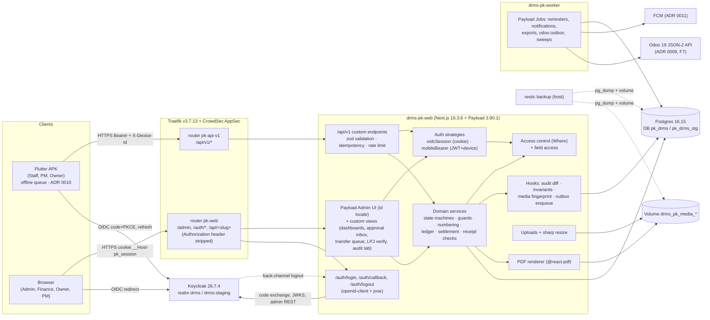
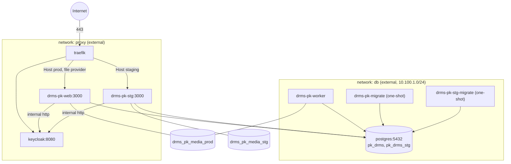
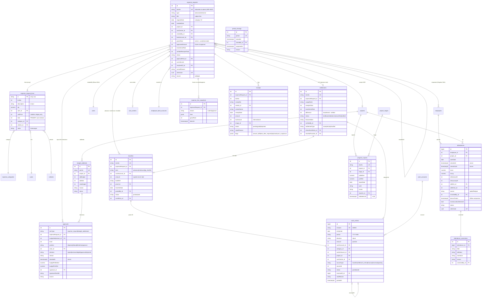
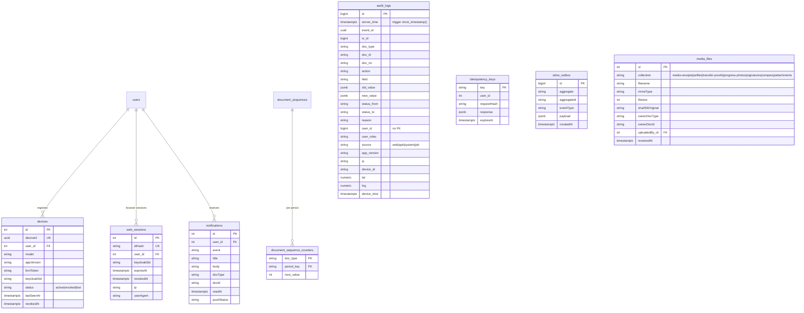
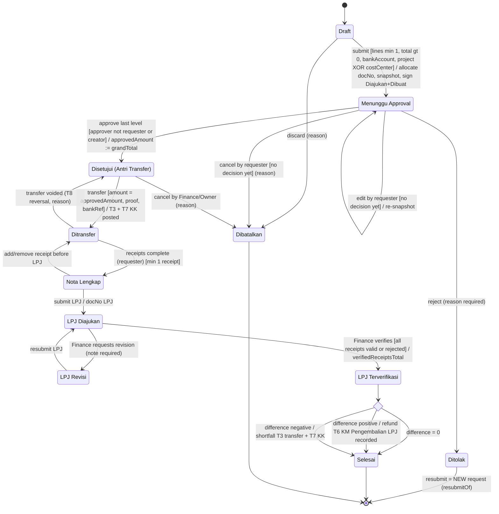
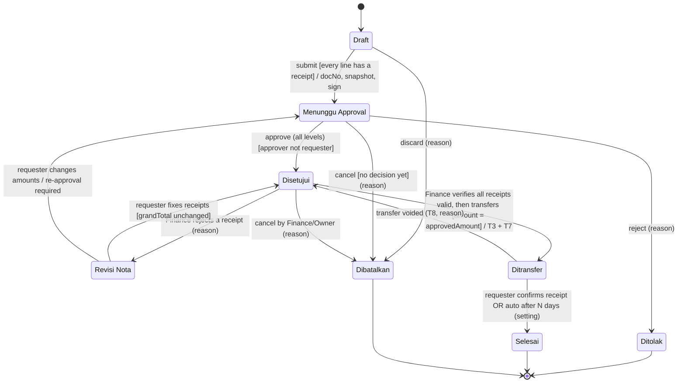
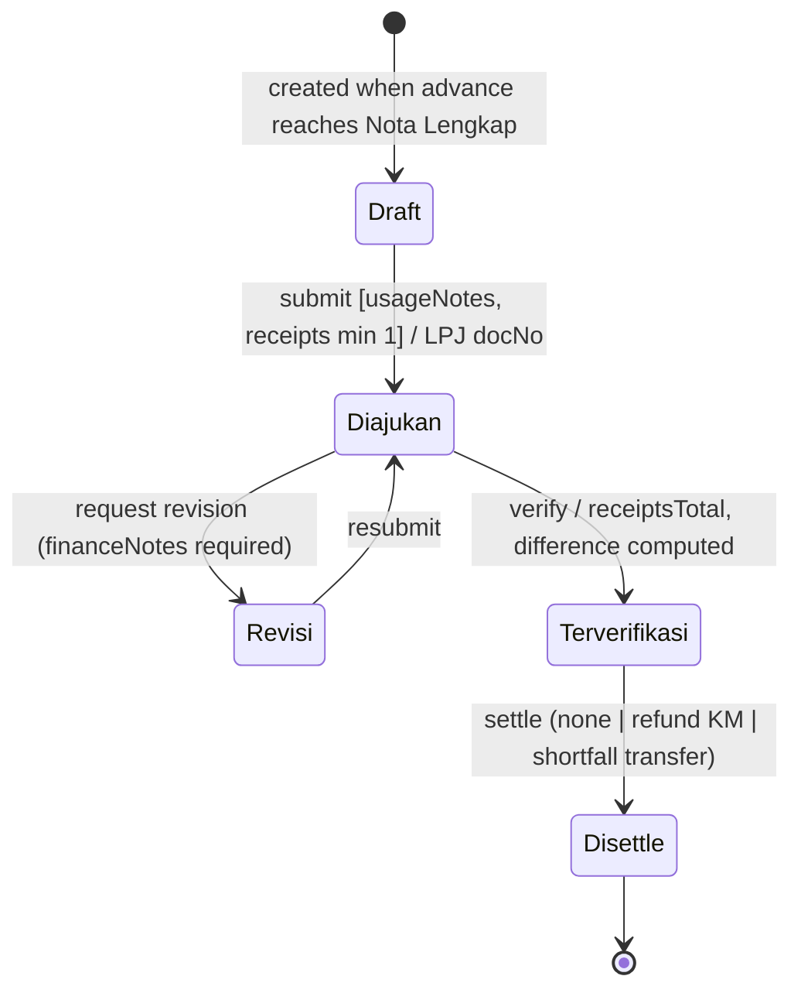
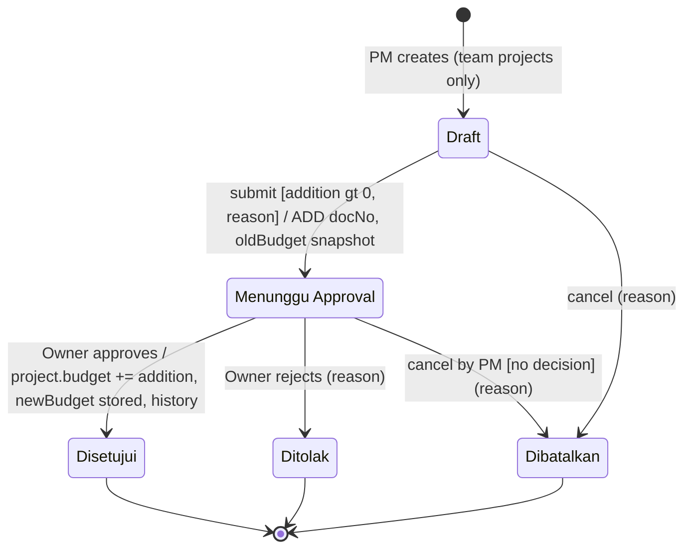

# ProyekKas — Architecture (Phase 0)

- **Status:** accepted (user, GATE F0 2026-09-23); revised 2026-09-23 after the F1 spike (user-approved, see §17 Revision history) · **Date:** 2026-09-23 · **Author:** Analyst/Architect (Phase 0)
- **Inputs:** `f0-brief.md` (binding decisions §2, direction §3; updated 2026-09-23 with the line-total
  decision), `reference/proyekkas-kebutuhan-pengembangan.md` (requirements v1.0), `reference/prompt-lead-proyekkas.md`
  ("Temuan tambahan" 1–10), `reference/contoh-form-pengajuan-biaya-drms.jpg`, `/opt/infra/CLAUDE.md`,
  platform ADRs `/opt/infra/docs/adr/0001, 0004, 0006`, `/opt/src/control-plane/*`, `/opt/infra/{identity/keycloak,traefik,postgres,scripts}` (read-only).
- **Decisions:** ADRs in `adr/0001`–`0008` (this set). Odoo mirror = `adr/0009-*.md`, mobile/offline sync =
  `adr/0010-*.md`, push = `adr/0011-*.md` (written by another agent — referenced, not repeated).
  Requirements v1.1 (Bahasa Indonesia) is written in parallel by another agent.
- **Prototype:** `proyekkas-prototipe.html` was **not provided** → dashboard layouts are "prototype not
  available"; only the card list from requirements US-27 is used.

Legend: **UNVERIFIED** = not confirmed from a source in this session; **ESTIMATE** = sizing assumption.

---

## 0. Sources used (all fetched/read 2026-09-23)

| Id | Source |
|---|---|
| S-NPM | `https://registry.npmjs.org/<pkg>[/<version>]` for payload, @payloadcms/{next,ui,db-postgres,translations,storage-s3,plugin-cloud-storage,richtext-lexical,graphql}, graphql, sharp, @react-pdf/renderer, @react-pdf/{layout,image}, pdfkit, pdf-lib, pdfmake, exceljs, xlsx, playwright-core, puppeteer-core, jose, openid-client, pg-boss, @asteasolutions/zod-to-openapi, payload-oapi, rate-limiter-flexible, pino, @directus/api, @strapi/strapi |
| S-PL | `github.com/payloadcms/payload` tag **v3.90.1** (tag object `30f5388`): `docs/**/*.mdx`, `packages/{payload,next,drizzle,db-postgres,translations,storage-s3,plugin-cloud-storage}/src/**` (tarball from codeload.github.com) |
| S-KC | `https://www.keycloak.org/docs-api/26.7.4/rest-api/index.html`; `raw.githubusercontent.com/keycloak/keycloak/26.7.4/docs/documentation/server_admin/topics/sso-protocols/{con-server-oidc-uri-endpoints,con-oidc-auth-flows}.adoc` |
| S-SH | `raw.githubusercontent.com/lovell/sharp/v0.35.4/docs/src/content/docs/{api-output,api-resize,api-utility,api-constructor,install}.md` |
| S-TR | `raw.githubusercontent.com/traefik/traefik/v3.7/docs/content/reference/routing-configuration/http/middlewares/{buffering,ratelimit}.md`; `/opt/infra/traefik/dynamic/**` |
| S-PG | `postgresql.org/docs/16/{ddl-priv,auth-pg-hba-conf,sql-createtrigger}.html`; `/opt/infra/postgres/{conf/pg_hba.conf,scripts/init-roles.sh,docker-compose.yml}` |
| S-OD | `docker exec odoo-pool-a grep …` in `/usr/lib/python3/dist-packages/odoo/addons/{account,hr_expense,base}` (read-only) |
| S-CS | compose spec `raw.githubusercontent.com/compose-spec/compose-spec/main/05-services.md` |
| S-GH | `api.github.com/repos/<repo>` (license, pushed_at) for payloadcms/payload, directus, strapi, exceljs, pdfkit, react-pdf, gotenberg, pdf-lib; Directus `license`, Strapi `LICENSE` raw files |
| S-HOST | `docker stats --no-stream`, `free -m`, `df -h /`, `docker network ls`, `docker exec control-plane` (musl 1.2.6, Alpine 3.24.2, ICU 78.3), `/usr/local/sbin/infra-deploy`, `/opt/infra/scripts/{backup.sh,lib/restic-common.sh}`, `/opt/infra/identity/keycloak/**` |

---

## 1. Scope, principles, and where this deviates from the Lead's direction

Scope: admin web (Payload admin = CRUD "CMS" + custom views/dashboards) for Admin/Finance/Owner/PM, a
versioned REST API `/api/v1` for the Flutter APK (Staff, PM, Owner quick approval), cash control
(T1–T8), project/progress/attendance (T9–T12), audit log, reports/exports, later one-way Odoo mirror.

Principles: server is the only source of truth and time; business transitions only through the domain
service (never via generic field edits); no hard delete; every tracked change atomic with its audit row;
Odoo-friendly data (integer Rupiah, UoM master, analytic via project/cost center, COA codes);
least privilege at every layer (Traefik → strategy → access function → DB role/trigger).

**Validated** (evidence in ADR 0001): Payload 3.90.1 fits Next 16.3.6 / React 19.3.0 / Node 24; Indonesian
admin locale `id` exists; custom auth strategies + `disableLocalStrategy` + login-view injection make
Keycloak-only login feasible; Where-returning access control covers own/team/assigned/all scopes;
Jobs Queue replaces pg-boss.

**Challenged / refined with evidence:**
1. **DB names** `drms_proyekkas_prod/_staging` match the Odoo pg_hba regexes → rename to `pk_drms` /
   `pk_drms_stg` (ADR 0006 §1).
2. **Remote logout via Keycloak session revocation alone is insufficient**: APK access tokens are
   validated locally (JWKS) and stay valid ≤ 300 s → app-side `devices` revocation check on every request
   (ADR 0003 §5).
3. **Keycloak token endpoint rate limit** (`ratelimit-login` 10/min/IP on `/protocol/openid-connect/token`)
   will throttle APK refreshes behind carrier NAT → infra change needed (ADR 0003 §6).
4. **No OpenAPI in Payload 3** → contract generated from our zod schemas (§6.4).
5. **Payload generic REST exposes every collection** → Traefik strips `Authorization` on non-`/api/v1`
   paths; APK never uses `/api/<slug>` (§6.1).
6. **Backups:** media volumes are not covered by the current `backup.sh` → infra change (ADR 0004 §6).
7. **Payload 4.0.0-canary** exists → major upgrade risk tracked (ADR 0001 §9).
8. **RAM**: ProyekKas would take ≈ 57% of the remaining client budget (steady) — fits, but tight (§13).

---

## 2. Component view



---

## 3. Deployment topology

### 3.1 Containers (details and limits: ADR 0002)

| Container | Env | Image target / command | Networks | mem_limit | Volumes |
|---|---|---|---|---:|---|
| `drms-pk-web` | prod | runner / `node server.js` | `proxy`, `db` | 640m | `drms_pk_media_prod:/data/media` |
| `drms-pk-worker` | prod | runner / `node dist/worker.mjs` | `db` (+ egress) | 320m | `drms_pk_media_prod:/data/media` |
| `drms-pk-migrate` | prod | migrate / `payload migrate` (one-shot) | `db` | 384m | — |
| `drms-pk-stg` | staging | runner / `node server.js` + jobs `autoRun` | `proxy`, `db` | 512m | `drms_pk_media_stg:/data/media` |
| `drms-pk-stg-migrate` | staging | migrate (one-shot) | `db` | 384m | — |

Shared (existing, not changed by ProyekKas except coordinated config): `traefik`, `crowdsec`, `postgres`,
`keycloak`. Hardening per ADR 0002 §2 (read-only rootfs, tmpfs, uid 1001, cap_drop ALL,
no-new-privileges, healthchecks, json-file 10m×3).


(`drms-pk-web` and `drms-pk-stg` are attached to both `proxy` and `db`.)

> **Revised 2026-09-23 (infra live, F1):** the web containers join **`drms-kas-edge`** (`10.100.7.0/24`,
> gw `10.100.7.1`; members: `traefik` + ProyekKas web only) instead of `proxy`, and they do **not** call
> `keycloak:8080`: all server-side OIDC/JWKS/Admin REST calls go to the public issuer
> `https://auth.bimacreative.tech` (hairpin through Traefik). In the diagram read `proxy` as `drms-kas-edge`
> for `W`/`S`, and the `internal http` edges as `https via traefik`. Source: infra runbook
> `/opt/infra/docs/runbooks/proyekkas-drms-onboarding.md` (infra `main` `c557c28`); ADR 0003 §6.

### 3.2 Hostnames (decided by user 2026-09-23: platform subdomain)
- prod: `drms-kas.bimacreative.tech` — needs ONE new manual A record → `31.97.50.221` at Hostinger (not covered by
  any wildcard; verified `dig` 2026-09-23: `*.erp`, `*.staging` exist, bare/`*.app` do not).
- staging: `drms-kas.staging.bimacreative.tech` — covered by existing `*.staging` wildcard.
- `drms.erp.bimacreative.tech` / `drms.staging.bimacreative.tech` stay reserved for DRMS's future Odoo DBs (F7). DNS pre-check + `le-http-staging`
first, per CLAUDE.md §3.5.1. APK App Link host = prod host (ADR 0003/0010).

### 3.3 Traefik routes (file provider `/opt/infra/traefik/dynamic/clients/drms-proyekkas-{prod,staging}.yml`; pseudo-config, infra-engineer finalises)

**Live state (staging, infra `main` `c557c28`, verified by Lead 2026-09-23)** — supersedes the F0 table below
where they differ (`/opt/infra/traefik/dynamic/clients/drms-proyekkas-{staging,middlewares,kc-token}.yml`):

| Router | Rule (host `drms-kas.staging.bimacreative.tech`) | Middlewares | Priority |
|---|---|---|---|
| `drms-pk-stg-auth` | `PathPrefix(/auth/) \|\| PathPrefix(/api/v1/auth/)` | `crowdsec`, `security-headers`, `ratelimit-login` | 100 |
| `drms-pk-stg-api-v1` | `PathPrefix(/api/v1/)` (Authorization passed through) | `crowdsec`, `security-headers`, `ratelimit-pk-api` (20/s, burst 40), `buffering-pk` | 90 |
| `drms-pk-stg-api-rest` | `PathPrefix(/api/) && !PathPrefix(/api/v1/)` (Payload generic REST, admin uploads) | `crowdsec`, `security-headers`, `ratelimit-default`, `strip-authorization`, `buffering-pk` | 50 |
| `drms-pk-stg-web` | catch-all (`/admin`, Next assets, `/.well-known/assetlinks.json`) | `crowdsec`, `security-headers`, `ratelimit-default`, `strip-authorization` — **no buffering** | 1 |
| `auth-drms-token` (host `auth.bimacreative.tech`) | `Path(/realms/{drms,drms-staging}/protocol/openid-connect/token)` | `crowdsec`, `auth-security-headers`, `ratelimit-drms-kc-token` (60/min, burst 30) | 95 |

`buffering-pk` = `maxRequestBodyBytes` 10 485 760 (10 MiB) and `maxResponseBodyBytes` 16 777 216 (16 MiB), only on
`api-v1` and `api-rest` (a larger response there → 500; the `web` router is not buffered). Certificate
`le-http-staging` until the switch to `le-http`. Prod routers are added once the prod A record exists.

| Router | Rule | Middlewares (existing unless marked NEW) | Priority |
|---|---|---|---|
| `pk-auth` | `Host(<pk-host>) && (PathPrefix(/auth/) \|\| PathPrefix(/api/v1/auth/))` | `crowdsec`, `security-headers`, `ratelimit-login` | 100 |
| `pk-api-v1` | `Host && PathPrefix(/api/v1/)` | `crowdsec`, `security-headers`, **NEW `ratelimit-pk-api`** (avg 20/s, burst 40 per IP — ESTIMATE), **NEW `buffering-pk`** (`maxRequestBodyBytes` 10 485 760; option verified S-TR) | 90 |
| `pk-web` | `Host(<pk-host>)` | `crowdsec`, `security-headers`, `ratelimit-default`, **NEW `strip-authorization`** (`headers.customRequestHeaders: {Authorization: ""}` — "" removes, pattern already used in `strip-odoo-db-headers.yml`), `buffering-pk` | 1 |
| Keycloak (existing `auth.yml`) | — | **NEW router for `/realms/drms/protocol/openid-connect/token`** with a higher limit (ADR 0003 §6) | — |

`security-headers` sets `frameDeny: true`: Payload admin live preview/iframes are not used → OK. CSP is
set by the app (per-request nonce in `apps/web/src/proxy.ts`, builder `src/lib/csp.ts`), not by Traefik.

**Admin CSP (verified F1 spike §f; user decision 2026-09-23)** — `PK_CSP_MODE=payload`, `PK_CSP_STRICT_DYNAMIC=false` (defaults):
```
default-src 'self'; script-src 'self' 'nonce-{n}'; style-src 'self' 'unsafe-inline'; img-src 'self' blob: data:;
font-src 'self' data:; connect-src 'self'; object-src 'none'; base-uri 'self';
form-action 'self' https://auth.bimacreative.tech; frame-ancestors 'none'
```
- **Scripts stay nonce-strict**, **no `'strict-dynamic'`** (it would let Monaco's JS from `cdn.jsdelivr.net` run).
  The strict variant produced 0 `script-src` violations.
- **`style-src 'unsafe-inline'` accepted** (styles only, no script execution): Payload/react-select inject
  runtime `<style>` and `style=` attributes (123–135 `style-src-attr` + 47 `style-src-elem` violations under a
  nonce-only style policy → visibly broken admin). No nonce in `style-src` (it would disable `'unsafe-inline'`).
- **`form-action` includes the Keycloak origin** `https://auth.bimacreative.tech`; without it the logout
  303 to Keycloak is blocked.
- Required alongside: **no `json`/`code` field editors** in the admin (Monaco loads from jsdelivr; user
  decision) and `admin.avatar: 'default'` (no gravatar) — ADR 0001 §8.

### 3.4 Volumes & data
Named volumes `drms_pk_media_prod`, `drms_pk_media_stg` (ADR 0004). DBs in shared cluster (ADR 0006 §1).
Backups: DB via existing dynamic dump; media via NEW `MEDIA_VOLUMES` entry in `backup.sh` (§15).

---

## 4. Data model

### 4.1 Conventions
- **Money = integer Rupiah** in Payload `number` fields (→ Postgres `numeric`, JS double; S-PL
  `traverseFields.ts` L744–751), validated `Number.isSafeInteger(v) && v >= 0` (negative only where
  semantically signed, e.g. `difference`). Odoo IDR rounding 0.01 (S-OD) → lossless mapping. Display
  `Rp 1.447.500`.
- **Quantities** `number` with ≤ 3 decimals (e.g. 24,80 L) validated; unit from **`uoms`** master (no free text).
- **Line totals (user decision 2026-09-23):** on expense-request lines **`total` is the primary, user-entered
  value** (may be user-rounded from the receipt, e.g. hotel 676.876 → 677.000 for 2 rooms). `unitPrice` is
  **informational/display only** (nullable; if empty the UI shows `total ÷ qty`). The server **must not
  enforce** `qty × unitPrice = total`. `grandTotal` = Σ line `total`, **server-computed** (client value
  ignored). Seed: 600.000 + 677.000 + 170.500 = **Rp 1.447.500**. Receipt-vs-line differences
  (677.000 − 676.876 = 124) are **flags** evaluated against `company-settings.receiptRoundingTolerance`,
  never blockers.
- **Analytic dimension**: every cost document references **`project` XOR `costCenter`** (form item 9:
  "Ops Palangka Banjar" is not a project). Both carry `odooAnalyticRef` for ADR 0009.
- **COA mapping**: `expense-categories.coaCode`, `cash-in-sources.coaCode`, `cash-accounts.odooJournalCode`.
- IDs: `idType: 'serial'` (explicit) as internal PK/FK. **Every mirrored collection also has `uuid`**
  (UUID, unique, immutable, server-generated at create) — the stable identity for the Odoo external ID
  required by ADR 0009 (`pk_<slug>_<uuid_hex>`), plus `odooId`/`odooXmlid` columns owned by ADR 0009.
  APK-created records additionally carry `clientUuid` (unique, nullable) = offline idempotency key (ADR 0010
  `client_uuid`). ERD below omits `uuid`/`odoo*` columns for readability.
- Timestamps: server `timestamptz` (UTC); business dates `date` in company TZ (`Asia/Makassar`); device
  times stored only as comparison fields (`deviceTime*`).
- Status fields: `select` (Postgres enum); `update` field-access = false — changed only by the domain
  service (`context.transition` + `overrideAccess: true`, see §7.4).
- No `delete` on business collections; masters have `active` (US-33: used data cannot be deleted).

### 4.2 ERD — masters

```mermaid
erDiagram
  users ||--o| employees : "linked to"
  users ||--o| media_signatures : "signature image"
  employees ||--o{ employee_bank_accounts : owns
  banks ||--o{ employee_bank_accounts : "bank of"
  clients ||--o{ projects : "client of"
  users ||--o{ projects : "PM of"
  projects ||--o{ project_stages : has
  stage_templates ||--o{ stage_template_items : contains
  projects ||--o{ budget_lines : "RAB per category"
  expense_categories ||--o{ budget_lines : category
  employees ||--o{ team_assignments : assigned
  projects ||--o{ team_assignments : staffed
  cost_centers ||--o{ vehicles : "home cost center"
  approval_rules ||--o{ approval_rule_steps : steps
  expense_categories }o--|| uoms : "default uom"

  users {
    int id PK
    string email
    string keycloakSub UK "OIDC sub"
    string rolesCache "pk-staff|pk-pm|pk-finance|pk-owner|pk-admin (mirror of token)"
    bool active
    int employee_id FK
    int signature_id FK
  }
  employees {
    int id PK
    string code UK
    string name
    string position
    string phone
    int faceRefPhoto_id FK
    bool active
  }
  employee_bank_accounts {
    int id PK
    int employee_id FK
    int bank_id FK
    string accountNo
    string accountHolder
    bool isDefault
    string verificationStatus "unverified|verified"
    bool active
  }
  banks {
    int id PK
    string code UK
    string name
  }
  clients {
    int id PK
    string name
    string contact
    string address
  }
  vendors {
    int id PK
    string name
    string contact
    string npwp
  }
  projects {
    int id PK
    string code UK
    string name
    int client_id FK
    string address
    numeric lat
    numeric lng
    int radiusM
    int pm_id FK
    int budget "RAB, integer Rupiah"
    date startDate
    date targetDate
    string status "perencanaan|berjalan|ditunda|selesai|arsip"
    string odooAnalyticRef
  }
  project_stages {
    int id PK
    int project_id FK
    string name
    numeric weightPct "sum = 100"
    int sequence
    numeric progressPct "only via progress_reports"
  }
  stage_templates {
    int id PK
    string name
  }
  stage_template_items {
    int id PK
    int template_id FK
    string name
    numeric weightPct
    int sequence
  }
  budget_lines {
    int id PK
    int project_id FK
    int category_id FK
    int amount
  }
  expense_categories {
    int id PK
    string code UK
    string name "Material|Upah|Alat|Transport|Operasional"
    string coaCode "Odoo account code"
    int defaultUom_id FK
    bool requiresVehicle
    bool active
  }
  cash_in_sources {
    int id PK
    string code
    string name "Termin|DP klien|Modal owner|Pengembalian LPJ|Lainnya"
    string coaCode
  }
  cash_accounts {
    int id PK
    string name "BCA Operasional, Kas Kecil"
    string accountNo
    string odooJournalCode
    bool active
  }
  team_assignments {
    int id PK
    int employee_id FK
    int project_id FK
    string roleInProject "pm|staff|mandor"
    date startDate
    date endDate
  }
  work_schedules {
    int id PK
    string name
    string startTime
    string endTime
    int lateToleranceMin
  }
  holidays {
    int id PK
    date date
    string name
  }
  approval_rules {
    int id PK
    string docType "expense_request|budget_addendum"
    int minAmount
    int maxAmount
    int category_id FK "optional"
    int project_id FK "optional"
    string signaturePositions "diajukan|dibuat|diketahui|approval config"
  }
  approval_rule_steps {
    int id PK
    int rule_id FK
    int level
    string position
    string approverRole
    int approverUser_id FK
  }
  notification_templates {
    int id PK
    string event
    string title
    string body
    string channel "push|inapp"
  }
  uoms {
    int id PK
    string code UK
    string name "liter|kamar|malam|porsi|bulan|pcs|trip"
    string category
    string odooUomRef
  }
  vehicles {
    int id PK
    string plateNo UK "normalised DA1234XY"
    string type "Hilux|Tronton"
    string status
    int costCenter_id FK
    string odooFleetRef
  }
  cost_centers {
    int id PK
    string code UK
    string name "Ops Palangka Banjar"
    string type "operational|department"
    bool active
    string odooAnalyticRef
  }
  document_sequences {
    int id PK
    string docType UK
    string pattern
    string resetPolicy
    int padding
    string timezone
  }
```


Global `company-settings`: name, shortCode `DRMS`, logo, timezone, default geofence radius, late-report
days (3), budget thresholds (85/100 %), progress-vs-budget colour thresholds (0/8 %), receipt rounding
tolerance (Rp), min APK version, offline max age, reimburse auto-close days.

### 4.3 ERD — transactions


Progress photos (≤ 5) are `media-progress-photos` docs with an FK `progressReport` (keeps
`progress_reports` flat, ADR 0006 §2). Receipt images likewise reference their owner.

### 4.4 ERD — system


`media_files` is a notation for the 7 `media-*` upload collections (same field set, separate tables).
`odoo_outbox` (collection `odoo-outbox`) shape is owned by ADR 0009 — columns shown are indicative only.

---

## 5. State machines

### 5.1 T1 — Uang Muka (advance)


`difference = transferredTotal − verifiedReceiptsTotal`. Refund cash-in requires proof of the staff's
return transfer (proof optional per US-23 — client question).

### 5.2 T1 — Reimburse


Finance receipt verification happens **before** transfer (lead prompt #1); receipt flags (§5.6) are shown
but do not block. Finance cannot change `approvedAmount` (G3).

### 5.3 T5 — LPJ (settlement document)



### 5.4 T12 — Budget addendum (Addendum RAB)


Concurrent addenda: `oldBudget` is re-read under row lock of the project at approval; `newBudget =
current budget + addition` (not the snapshot).

### 5.5 Server-side guards (enforced in domain service; critical ones duplicated in hooks/DB)

| # | Guard | Where enforced |
|---|---|---|
| G1 | Requester (any listed requester employee's user) and creator **cannot approve** their own request; no user may hold two decision levels on one document | service + `approvals` beforeChange hook |
| G2 | Approver must match the rule step (role/user) for the current level; rule chosen by amount/category/project at submit and snapshotted | service |
| G3 | **Finance cannot change the approved amount**: transfer amount is copied from `approvedAmount` server-side; any change to lines/total after approval returns the request to Menunggu Approval (reimburse) or is rejected (advance) | service + field access (`approvedAmount`, `lines` update=false after approval) |
| G4 | **No hard delete**: `access.delete = () => false` on all business collections; DB role has no DELETE on Class A/B tables; `beforeDelete` logs `delete_attempt` | Payload + DB (ADR 0006) |
| G5 | **Period lock**: no insert/update of cash entries dated ≤ lock date; transfers/settlements dated in a closed period are refused | service + DB trigger (ADR 0005) |
| G6 | Status only changes through listed transitions (table-driven state machine); `status` field access update=false; hook rejects status diff without `context.transition` | service + hook |
| G7 | Reason mandatory for: cancel, reject, void, LPJ revision, receipt reject, attendance correction, stage weight change, project archive, user deactivation, period reopen | service + audit hook |
| G8 | Edit/cancel by requester only while Draft or Menunggu Approval with no decision rows (US-04) | service |
| G9 | Bank account must belong to one of the requesters and be `active` (verified status shown; blocking = client question) | service |
| G10 | Project scope: Staff may create requests only for projects they are assigned to (or cost centers allowed to them); PM only for team projects | service + access |
| G11 | Stage weights of a project sum to 100 % (US-29); `progressPct` only changes via progress reports (requirements §1 #7) | hook + field access |
| G12 | Project with transactions cannot be deleted — only archived (US-29) | G4 + service |
| G13 | Attendance: server time only; one check-in per employee/project/day; within geofence radius; selfie required; mock-location flag rejects (US-01) | service |
| G14 | Progress report editable ≤ 24 h by its reporter, reason required (§8 T11) | service + trigger |
| G15 | Idempotency: every mutating `/api/v1` call with `Idempotency-Key` returns the first result on retry | API layer |
| G16 | Inactive user / revoked device / revoked web session → 401 on every request | auth strategies |

### 5.6 Receipt validation flags (lead prompt #7 — flag, never block)
`amount_diff` (|receipt − line total| > tolerance; per-line sum of receipts), `date_after_request` /
`date_out_of_period`, `uom_suspicious` (category default UoM ≠ line UoM, e.g. BBM with "bulan"),
`duplicate` (same receiptNo + vendor + amount, or same `sha256Original`, in any other request),
`vehicle_missing` (category requires vehicle). Computed on receipt save and on LPJ submit; shown to
Finance (list badges, PDF internal variant). OCR pre-fill = nice-to-have (F6+).

---

## 6. API design

### 6.1 Surfaces
| Surface | Consumers | Auth | Notes |
|---|---|---|---|
| Payload admin `/admin/**` | browsers | `oidcSession` cookie | Payload UI + custom views |
| Payload REST `/api/<slug>` | **admin UI only** | cookie; `Authorization` stripped at Traefik | not part of the public contract, not versioned, may change on Payload upgrades |
| `/auth/*` | browsers | — | OIDC login/callback/logout (ADR 0003) |
| **`/api/v1/*`** | APK, admin custom views, future integrations | `mobileBearer` (+ `X-Device-Id`) or cookie | versioned contract, OpenAPI |
| GraphQL | — | — | disabled (`graphQL.disable: true`) |

`/api/v1` is implemented as Payload root custom endpoints (`endpoints: [{ path: '/v1/…', method, handler }]`,
handler gets `req.user` from strategies — S-PL `docs/rest-api/overview.mdx` §Custom Endpoints), each
handler = zod parse → domain service → response DTO. Root-level `endpoints` are "accessed respective of
the api and slugs you have configured" → served at `/api/v1/...` with default `routes.api = '/api'`
(docs §Custom Endpoints; source `packages/payload/src/utilities/handleEndpoints.ts` L184 uses
`config.endpoints` when no collection matches). Docs warning: **"Custom endpoints are not authenticated by
default"** → every handler starts with `requireUser(req)` + role/scope check (wrapper enforced by lint).

### 6.2 Conventions
- Versioning: URL major (`/api/v1`); additive changes only within v1; breaking → `/api/v2` served in
  parallel for ≥ 1 APK release cycle. APK sends `X-App-Version`; below `company-settings.minAppVersion`
  → `426 Upgrade Required`.
- Errors: RFC 9457 `application/problem+json` (`type`, `title`, `status`, `detail`, `code`, `errors[]`).
- Pagination: `?limit` (≤ 100) + opaque `cursor`; filters whitelisted per endpoint.
- Idempotency: `Idempotency-Key` (UUID) required on POST mutations from APK; stored 72 h with request hash.
- Time: server returns ISO-8601 UTC + `serverTime` header; clients never send authoritative timestamps
  (device times only in `deviceTime*` fields).
- Money as integers; quantities as decimal strings or numbers ≤ 3 dp.

### 6.3 Endpoint catalogue (v1, initial)
```
GET  /api/v1/health | /api/v1/health/ready
GET  /api/v1/me                              profile, roles, scopes, settings subset
POST /api/v1/devices/register | POST /api/v1/devices/{id}/revoke
GET  /api/v1/masters?types=projects,categories,uoms,vehicles,cost-centers,bank-accounts&since=
GET  /api/v1/expense-requests?scope=mine|team|inbox  |  GET /api/v1/expense-requests/{id}
POST /api/v1/expense-requests                         (draft; clientUuid)
PATCH /api/v1/expense-requests/{id}                   (draft/pending edit, G8)
POST /api/v1/expense-requests/{id}/submit | /approve | /reject | /cancel | /resubmit
POST /api/v1/expense-requests/{id}/transfer           (Finance; multipart proof)
POST /api/v1/expense-requests/{id}/transfer/{tid}/void
POST /api/v1/expense-requests/{id}/receipts           (multipart image + fields)
POST /api/v1/expense-requests/{id}/receipts/{rid}/verify | /reject
POST /api/v1/expense-requests/{id}/receipts-complete
POST /api/v1/expense-requests/{id}/lpj/submit | /lpj/request-revision | /lpj/verify | /settle
GET  /api/v1/expense-requests/{id}/pdf[?variant=internal]
GET  /api/v1/expense-requests/{id}/history            (audit tab, US-35)
GET  /api/v1/approvals/inbox                          (Owner; budget impact % before→after, US-26)
POST /api/v1/cash-entries | POST /api/v1/cash-entries/{id}/void | GET /api/v1/cash-accounts/balances
POST /api/v1/period-closings | POST /api/v1/period-closings/{period}/reopen
POST /api/v1/attendance/check-in | /check-out | /on-behalf (PM) | POST /api/v1/attendance/{id}/correct
GET  /api/v1/attendance/today?project= | GET /api/v1/attendance/me?month=
POST /api/v1/progress-reports (multipart ≤5 photos) | PATCH /api/v1/progress-reports/{id}
POST /api/v1/budget-addenda | /{id}/submit | /approve | /reject
POST /api/v1/sync/batch                               (offline queue replay — contract in ADR 0010)
GET  /api/v1/notifications | POST /api/v1/notifications/{id}/read
GET  /api/v1/files/{collection}/{id}[?variant=thumb&exp&sig]
GET  /api/v1/dashboard/{owner|finance|pm|staff}
GET  /api/v1/reports/{cash-recap|budget-vs-actual|attendance|requests|vehicle-costs}?format=json|xlsx|pdf
POST /api/v1/auth/backchannel-logout                  (NOT USED: back-channel logout disabled, ADR 0003 §1 rev. 2026-09-23)
GET  /api/v1/openapi.json                             (auth required outside dev)
```

### 6.4 OpenAPI
Payload 3 has no OpenAPI generator (S-PL grep; `@payloadcms/plugin-openapi` 404 on npm). Third-party
`payload-oapi@0.3.0` (MIT, 0.x) documents Payload's generic REST — not needed since `/api/<slug>` is not a
public contract. Decision: zod schemas per endpoint → **`@asteasolutions/zod-to-openapi@9.1.0`** (MIT,
peer `zod ^4.0.0`, published 2026-07-19) → `openapi.json` (OpenAPI 3.x) generated at build, committed in
`packages/api-contract/`, CI drift check, Dart client generation for the APK (generator choice =
flutter-developer; UNVERIFIED). zod version: pin `4.6.5` like control-plane.

### 6.5 Rate limiting
Edge (Traefik, per source IP): `ratelimit-pk-api` 20/s burst 40 (ESTIMATE; carrier-NAT aware), login
paths `ratelimit-login`. App (per user/device, in-process token bucket — single web instance): submit/
approve 30/min, uploads 60/min, PDF 10/min, exports 5/min, `sync/batch` 12/min. `rate-limiter-flexible@11.2.1`
(ISC) is an option; in-memory is sufficient for one instance (state lost on restart — acceptable).

---

## 7. Authorization model

### 7.1 Roles × scope (requirements v1.0 §4, extended)
Roles come from Keycloak realm roles (`pk-staff`, `pk-pm`, `pk-finance`, `pk-owner`, `pk-admin`); a user
may hold several → permissions are the **union**. Scopes resolved once per request and cached in
`req.context.scope`:
- `own` = records where `requesters ∋ user.employee` or `createdBy = user` (or `employee = user.employee`)
- `team` = records whose `project ∈ teamProjects(user)` where `teamProjects` = projects with `pm = user`
  or active `team_assignments(roleInProject='pm')` for `user.employee`
- `assigned` = `project ∈ assignedProjects(user)` = active `team_assignments` of `user.employee`
- `all` = no constraint

### 7.2 Mapping to Payload access functions (pseudo-code, not final)
```ts
// expense-requests.access.read
read: ({ req }) => {
  const r = req.user?.roles ?? []
  if (r.some(x => ['pk-finance','pk-owner','pk-admin'].includes(x))) return true            // all
  const or: Where[] = []
  if (r.includes('pk-staff') || r.includes('pk-pm')) or.push(
    { requesters: { contains: req.user.employee } }, { createdBy: { equals: req.user.id } })  // own
  if (r.includes('pk-pm')) or.push({ project: { in: req.context.scope.teamProjects } })       // team
  return or.length ? { or } : false
}
```
| Collection (key ops) | Staff | PM | Finance | Owner | Admin |
|---|---|---|---|---|---|
| expense-requests R | own | own + team | all | all | all |
| expense-requests C/U | own (G8) | own | — (transitions only) | — | — |
| approve (service) | — | level-1 optional (rule) | — | all | — |
| transfers C | — | — | all | — | — |
| receipts C/U | own (before LPJ) | R team | R/V all | R all | — |
| cash-entries C/X | — | R summary team (dashboard endpoint, not collection) | all | R all (+X optional) | — |
| projects/stages | R assigned | R/U team | R | C/R/U/archive | R |
| budget-addenda | — | C team | R | A | — |
| progress-reports | — | C/R team | R | C/R all | — |
| team-assignments | — | C/R/U team | — | R/U | C/R/U |
| attendances | C/R own | C on-behalf, U via correction, team | R all | R all | R/U |
| masters (categories, cash accounts, banks) | R (needed lists) | R | C/R/U | R/U | C/R/U |
| users & roles | — | — | — | R | C/R/U |
| audit-logs | R own docs | R team docs | R all | R all | R all |
Field-level: `approvedAmount`, `docNo`, `status`, `grandTotal`, `transferredTotal`, `postedAt`,
`progressPct` have `update: () => false` for everyone; `employee-bank-accounts.accountNo` read limited to
own + Finance/Owner/Admin and reads audited (`view_sensitive`).
`access.admin` (panel entry): Admin, Finance, Owner, PM (PM sees only custom views + permitted
collections); Staff uses the APK (optional web access = client question).

### 7.3 Enforcement layers
Traefik (header strip, rate limit) → strategy (session/device/active) → collection/field access (Where)
→ domain guards (G1–G16) → DB role/triggers (ADR 0006). Every `/api/v1` read uses Local API with
`overrideAccess: false, user`; writes of system fields use `overrideAccess: true` **only inside the
domain service** after guards, tagged `// SYSTEM-WRITE` (Semgrep rule in CI).

### 7.4 Negative test set (must exist before F2 exit)
PM reads another PM's project request → 404/empty; requester approves own → 403; Finance PATCHes amount
after approval → 403; any DELETE on cash entry → 403 + `delete_attempt` row; Staff uses APK token on
`/api/expense-requests` (generic REST) → never authenticated: 403, or 200 `{user:null}` on `/api/users/me`
(header stripped by Traefik; strategy scoped to `/api/v1`, verified F1); revoked device with valid token → 401;
insert cash entry in closed period → rejected by DB even via raw SQL as app role.

---

## 8. Audit log
Design, capture mechanism, DB enforcement and migration interplay: **ADR 0006**. Summary: one flat
`audit_logs` table (fields of requirements §8 + event_id, tx_id, device_time, request_id), written in the
same transaction by `afterChange` diff hooks (per-field rows), with DB trigger + privilege revocation
making UPDATE/DELETE/TRUNCATE impossible for the app role and `server_time` forced by trigger. UI: "Riwayat"
tab = custom document view (`admin.components.views` document view — S-PL `custom-components/document-views.mdx`)
and global "Audit Log" list (filters date/user/doc type/action) for Owner/Admin.

---

## 9. Files, images, PDF

### 9.1 Image pipeline
APK compresses first (ADR 0010: target ≤ 2000 px, JPEG) → upload multipart ≤ 10 MiB → Payload
`beforeOperation`: rename to UUID, SHA-256 of received bytes → sharp: auto-orient, resize `inside`,
re-encode (JPEG/WebP/PNG per collection), strip metadata → `/data/media/<collection>/` → thumbnail size.
Targets per collection: ADR 0004 §2. Original discarded (flagged to client).

### 9.2 Access
Via collection `read` access derived from owner document; APK via `/api/v1/files/...`; HMAC signed
URLs (5 min) for deep links. ADR 0004 §4.

### 9.3 PDF
`@react-pdf/renderer@4.9.0` in web (single doc, semaphore 2) and worker (batch). Layout replicates the
client form; receipts 2 per page; internal variant shows validation flags. ADR 0008.

### 9.4 Excel export (M13)
Library **not decided**: `exceljs@4.4.0` (MIT) last published 2023-10-19, repo pushed 2025-01-21 → fails
CLAUDE.md §0.10 "< 6 months since last commit"; `xlsx@0.18.5` on npm last published 2022-03-24 (SheetJS
moved distribution off npm — not verified this session). Options for F3: CSV (UTF-8 BOM, `;` separator
for Indonesian Excel locale) as baseline + an XLSX writer selected by nextjs-developer with fresh
evidence (open decision, needs Lead/user).

---

## 10. Numbering
ADR 0007: `document-sequences` master + counters table, tokens incl. `{MM_ROMAN}`, default expense request
`{seq}/PB-{COMPANY}/{DD}/{MM_ROMAN}/{YYYY}` → `228/PB-DRMS/20/IX/2026`, allocation at submit inside the
transaction via row-locking `UPDATE … RETURNING`, unique backstop, TZ Asia/Makassar, reset policy =
client question (default yearly).

---

## 11. Jobs & cron
Payload Jobs Queue (ADR 0002 §4). Worker loop: `handleSchedules()` + `run({ queue })` every 30 s (prod);
staging `autoRun`. Tasks: reminders (late progress report N days, missing receipts after transfer +N days,
budget ≥ 85 %/100 %), attendance auto-close at midnight WITA, notifications fan-out (in-app + FCM),
report exports, Odoo outbox dispatch (F7), media orphan sweep, idempotency/web-session purge, daily
audit hash anchor (optional). Jobs are idempotent (dedupe key per business event, Payload task
`concurrency` keys — S-PL `queues/localAPI.ts`). Failures after retries → admin notification + log alert.

---

## 12. Observability
- Logs: pino JSON (Payload `logger` option; `pino@10.3.1` as control-plane) to stdout → Docker json-file →
  Alloy/Loki (platform). Fields: `requestId` (from `X-Request-Id`, generated in `proxy.ts` like
  control-plane), `userId`, `deviceId`, `route`, `status`, `durationMs`; no PII bodies, no tokens,
  bank numbers masked.
- Health: `/api/v1/health` (liveness, no DB), `/api/v1/health/ready` (DB `SELECT 1`, media dir writable,
  JWKS cache age); worker heartbeat file (control-plane pattern). Uptime Kuma HTTP monitor on
  `/api/v1/health/ready` (platform).
- Metrics (lightweight): jobs queued/failed counts and last success per task exposed on an admin-only
  view + `/api/v1/health/ready` payload; Prometheus scraping optional later.
- Alerts: job failure > N, backup of `pk_drms` missing (platform restic check), disk media growth > plan,
  HTTP 5xx rate (Loki query), login failures spike (Keycloak).

---

## 13. Capacity (details ADR 0002 §6; all app numbers ESTIMATE)

| Component | mem_limit MiB | cpus | Status |
|---|---:|---:|---|
| drms-pk-web (prod) | 640 | 0.75 | ESTIMATE |
| drms-pk-worker (prod) | 320 | 0.25 | ESTIMATE |
| drms-pk-stg (web+jobs) | 512 | 0.5 | ESTIMATE |
| **Steady total** | **1 472** | 1.5 | of ≈ 2 568 MiB client budget (platform ADR 0004) → **57 %**, fits |
| migrate one-shot (deploy only) | +384 | 0.5 | transient peak 1 856 MiB (72 %) |
| Postgres / Keycloak / Traefik | 0 new | — | load inside existing limits |

Disk (ESTIMATE, assumptions ADR 0004 §5): media ≈ 485 MB/month ≈ **5.8 GB/year** after resize; DB ≈
0.5–1 GB/year; restic repo ≈ 1–1.5× (dedup). Host free: 167 G (S-HOST). No overrun flagged; the
measurement gate is F1 (idle) and F6 (load).

---

## 14. Security / threat model (STRIDE-lite)

| Asset / entry | Threat (STRIDE) | Mitigation | Verified by |
|---|---|---|---|
| APK tokens | S: stolen refresh token on lost phone | Keystore storage, refresh rotation, device revoke → immediate 401 (G16), Keycloak offline-session delete | QA F4 |
| Web session cookie | S/T: CSRF, fixation | `__Host-` cookie, SameSite=Lax, Origin check on unsafe methods, new session id per login, back-channel logout | QA F1 |
| `/api/<slug>` generic REST | E: APK token or bug exposes collections | Traefik strips `Authorization`; Where-based access; negative tests §7.4 | QA F1/F2 |
| Local API `overrideAccess` default true | E: privilege escalation in custom code | `overrideAccess:false` rule + Semgrep custom rule + review | QA F1 |
| Approvals | R/E: self-approval, forged approver | G1/G2, approvals Class A append-only, signature hash | QA F2 |
| Cash ledger | T/R: edit/delete history, back-dated entries | Class B triggers, period lock trigger, void with reason, audit | QA F2 |
| Audit log | T/R: tampering | Class A (revoke + trigger + server time), optional hash chain | QA F1 |
| Attendance | S: fake GPS/time, proxy check-in | server time, mock-location flag (APK), geofence server check, selfie, device binding; offline records flagged | QA F5 |
| Uploads | T/E/D: malicious files, SSRF, huge files | MIME allow-list, sharp re-encode, `pasteURL:false` **+ remote-URL guard hook on every upload collection** (F1: `pasteURL:false` alone still fetches `{filename,url}`), 10 MiB cap (Traefik buffering + Payload limits + AppSec), UUID names | QA F2 |
| Files | I: IDOR on receipts/selfies/bank proofs | owner-derived read access, signed URLs with user binding, `Cache-Control: private, no-store` | QA F2 |
| Bank account numbers | I: leakage | masked in lists/logs, reads audited, PDF export audited | QA F2 |
| Keycloak service account | E: `manage-users` abuse | secret only in env, scoped to realm `drms`, calls audited | QA F1 |
| API | D: flooding, heavy PDF/export | Traefik rate limits, app token buckets, PDF semaphore, jobs for batch | QA F6 load test |
| DB | I/E: other tenants' roles | DB rename off Odoo regex, REVOKE CONNECT FROM PUBLIC, per-role pg_hba | infra + QA F1 |
| Supply chain | T: compromised npm deps | exact pins, lockfile, Trivy/npm audit/Semgrep, Renovate PRs via staging | CI |
| Offline sync | T/R: replayed or reordered actions | idempotency keys, server-side state machine validation on replay, device time only as comparison (ADR 0010) | QA F4 |

---

## 15. Backup integration (platform ADR 0006)
- DB `pk_drms` (+ `pk_drms_stg` optional) → covered automatically by `backup.sh` dynamic DB list (S-HOST,
  `backup.sh` L44).
- Media → **infra change**: add generic `MEDIA_VOLUMES=(drms_pk_media_prod)` (volume root, no `filestore/`
  subdir) to `restic-common.sh`/`backup.sh`; order DB first, files second (already the script's design).
- Keycloak realm `drms` → covered by the existing Keycloak DB dump + realm export files.
- Restore test (monthly, platform): restore `pk_drms` into `restoretest_pk_drms` + media into a temp dir,
  run `payload migrate:status` + `/api/v1/health/ready` against it, report RTO.
- Pre-deploy (prod): ad-hoc `backup.sh` DB-only run before migrations (infra-deploy extension — coordination).

---

## 16. Consolidated UNVERIFIED items (to close in F1 spikes unless noted)

> **F1 spike status (2026-09-23, `spikes/f1-spike-report.md`):** closed — 1 (Next route handlers `/auth/*`
> alongside the `(payload)` route group, spike §a), 2 (except `__Host-` cookie over HTTPS and the
> `/api/users/logout` inactivity path, verify on staging), 3, 4, 5 (no TZ option → process `TZ`), 6, 7,
> 8 (minimal CSP §3.3), 10 (ADR 0002 §6). Partly open — 9 (resize verified; HEIC decode and legibility at
> 2000 px still UNVERIFIED). Still open — 11–14. New — Admin REST reachability from `drms-kas-edge` through `ipallowlist-admin` (ADR 0003 §6).
1. ~~Root custom endpoints path~~ — resolved (docs + source, §6.1); remaining: Next.js route handlers `/auth/*` coexisting with Payload's `(payload)` route group (F1 smoke).
2. Payload admin works fully with `disableLocalStrategy` + custom cookie strategy (logout, account view, `me`) (ADR 0003).
3. Keycloak 26.7.4 access tokens contain `sid`; minimal realm-management roles to delete sessions; internal `http://keycloak:8080` requests yield public `iss` (ADR 0003).
4. Worker bundling of the Payload config outside Next (ADR 0002).
5. Payload cron schedule timezone support (ADR 0002 §4).
6. Drizzle transaction handle for raw SQL inside Payload request transaction (ADR 0007).
7. Payload `create` on a flat collection issues no hidden UPDATE/DELETE (needed for Class A tables) (ADR 0006).
8. Strict CSP compatibility of the Payload admin (§3.3).
9. HEIC input support in prebuilt sharp; receipt legibility at 2000 px (ADR 0004).
10. Real RAM of Payload web/worker (ADR 0002 — measurement gate).
11. `Intl` currency-style separator (ADR 0008; we avoid it).
12. Excel library choice (§9.4); Dart OpenAPI client generator (§6.4).
13. CrowdSec AppSec behaviour for bodies > 10 MiB (ADR 0004).
14. Keycloak admin events endpoint for importing login failures (ADR 0003 §7).

## 17. Revision history

- **2026-09-23 (F0 gate):** accepted by user.
- **2026-09-23 (F1 spike, user-approved):** Payload 3.90.1 = GO (user). §3.1 network `drms-kas-edge` and
  Keycloak via public issuer (hairpin); §3.3 live staging routers `drms-pk-stg-{auth,api-v1,api-rest,web}` +
  `auth-drms-token`, buffering only on api-v1/api-rest (request 10 MiB, response 16 MiB); "CSP compatibility
  UNVERIFIED" replaced by the minimal admin CSP (user decision: `style-src 'self' 'unsafe-inline'`, scripts
  nonce-strict without `'strict-dynamic'`, `form-action 'self' https://auth.bimacreative.tech`; no
  `json`/`code` editors); §6.3 back-channel logout endpoint unused; §7.4 generic-REST expectation 403 /
  `{user:null}`; §14 upload guard hook; §16 spike status.
